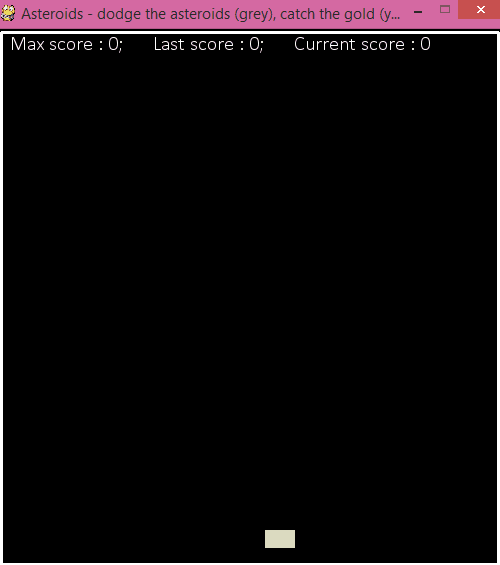

## Asteroids
Simple game where the player has to dodge the asteroids (grey) and catch the golden coins (yellow). 

The idea is to create a simple environment for training a deep (convolutional) neural network.  
The CNN will be coded and published at a later stage.

Feel free to code your own agent (see details below).

### Quick Start
Download `asteroids v1.0.py` and launch it.  
When playing as a human, hold the mouse button to move left or leave it to move right.

If you wish to code your own agent to play to game, you need to:  
1) create a `class Agent` in file `CNN_Agent.py` (and save it in the same folder as this game);  
2) implement a method `self.__init__`  that accepts `SCREEN_WIDTH` (int) as input;  
3) implement a method `self.choose_action(image, reward, is_terminal)`  
that accepts:  
    - `image`: array, image made of raw pixels captured from the game screen;  
    - `reward`: float, reward received at that particular state;  
    - `is_terminal`: bool, indicates if the player is at a terminal state;  
and returns:  
    - `(+1)` for right move, `(0)` for no move, and `(-1)` for left move;  
4) implement a method `self.close()` that clears the graph of Tensorflow.  

### Requirements
* PyGame. I used version 1.9.2a0.  
You can download it from [here][1].  

[1]: http://www.pygame.org/download.shtml
