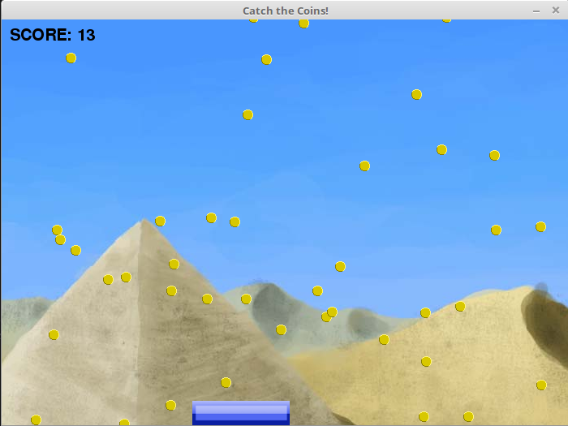

# Coin Catch

    

An endless game of catching falling coins. Bootstrapped with [pygame_template](https://github.com/alchermd/pygame_template).

## Controls

Use the `LEFT` and `RIGHT` key to control the paddle.

## License

See [LICENSE](./LICENSE) for more information.